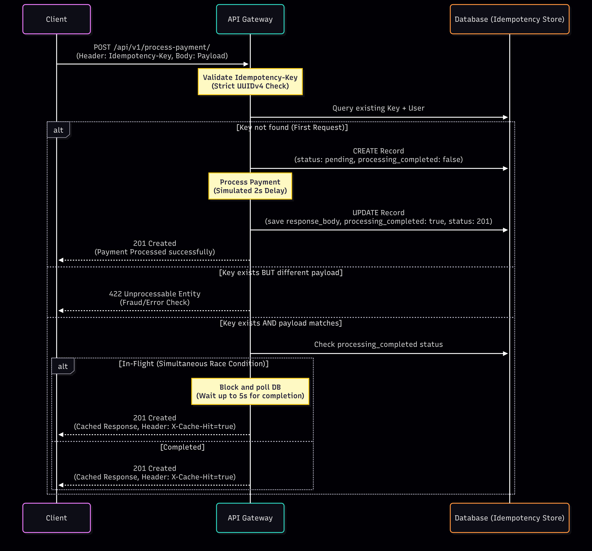

# Idempotency-Gateway (The "Pay-Once" Protocol)

Welcome to the **Idempotency-Gateway** repository—a robust robust middleware service simulating a real-world payment processing environment with comprehensive idempotency guarantees.

## 1. Business Context & Objective

In high-concurrency e-commerce environments, network drops or client delays can trigger automated payment request retries. For payment processors like _FinSafe Transactions Ltd._, this can lead to catastrophic double-charge scenarios, resulting in poor customer experience, support overhead, and regulatory issues.

This API acts as an **Idempotency Layer**. It processes a unique `Idempotency-Key` sent via HTTP headers on every payment request to ensure that a transaction is evaluated and charged exactly _once_, no matter how many duplicate attempts arrive from the client.

---

## 2. Architecture & Logic Flow

The sequence diagram below illustrates the idempotency mechanism for payment processing. When a client sends a `POST /api/v1/process-payment/` request with an `Idempotency-Key` header and payment payload, the API Gateway ensures the transaction is processed exactly once, even under concurrent retries or network issues.

### Key Flow Steps:

- **Validation**: The Gateway validates the `Idempotency-Key` as a strict UUIDv4 to prevent weak or predictable keys.
- **Database Check**: Queries the Idempotency Store (Database) for an existing record matching the key and authenticated user.
- **First Request Handling**: If no record exists, a new pending record is created, payment is processed (simulated with a 2-second delay), and the record is updated with the success response.
- **Duplicate Request Handling**: If a record exists but the payload differs, a 422 error is returned to flag potential fraud or inconsistency.
- **Cached Response**: If the record exists and the payload matches, the Gateway checks if processing is complete. For in-flight requests (race conditions), it polls the database briefly (up to 5 seconds) before returning the cached response with an `X-Cache-Hit: true` header.
- **Error Recovery**: If payment processing fails, the pending record is deleted to allow retries.

This design prevents double-charging, handles concurrency via database polling, and ensures reliability in high-traffic scenarios.



---

## 3. Setup Instructions

The project is built on **Python 3.x** and **Django REST Framework (DRF)**. A standard SQLite database is utilized by default to persist the idempotency records reliably.

### Prerequisites

- Python 3.10+
- `pip` package manager
- `git`

### Installation Steps

1. **Clone the Repository** (Or fork depending on your workflow)

   ```bash
   git clone git@github.com:Frederick-Teye/Idempotency-Gateway.git
   cd Idempotency-Gateway
   ```

2. **Create and Activate a Virtual Environment**

   ```bash
   python -m venv venv
   source venv/bin/activate  # On Linux/macOS
   # On Windows: venv\Scripts\activate
   ```

3. **Install Dependencies**

   ```bash
   pip install -r requirements.txt
   ```

4. **Setup Environment Variables**
   Rename the provided `.env-example` file to `.env` and update the variables if necessary.

   ```bash
   cp .env-example .env
   ```

5. **Run Database Migrations**

   ```bash
   python manage.py makemigrations
   python manage.py migrate
   ```

6. **Start the Development Server**
   ```bash
   python manage.py runserver
   ```
   _The server should now be running locally at `http://127.0.0.1:8000/`._

---

## 4. API Documentation

Because modern financial platforms require security, the gateway incorporates Token-Based Authentication. You must first register a user and obtain a token before processing payments.

### A. Authentication Endpoints

#### `POST /api/v1/auth/register/`

Create a new client/user account.

- **Body:**
  ```json
  {
    "email": "store@example.com",
    "password": "strongpassword123",
    "password_confirm": "strongpassword123"
  }
  ```
- **Response (201 Created):**
  ```json
  {
      "user": { ... },
      "token": "a1b2c3d4e5f6g7h8i9j0"
  }
  ```

#### `POST /api/v1/auth/login/`

Login to receive your Auth Token.

- **Body:**
  ```json
  {
    "email": "store@example.com",
    "password": "strongpassword123"
  }
  ```

---

### B. Payment Endpoint

#### `POST /api/v1/process-payment/`

Process a payment idempotently.

- **Headers:**
  - `Authorization: Token <your-auth-token>`
  - `Idempotency-Key: <valid-uuid-v4>` (Required)
  - `Content-Type: application/json`

- **Request Body:**
  ```json
  {
    "amount": "100.50",
    "currency": "GHS"
  }
  ```

#### Expected Behaviors & Responses

1. **The First Transaction (Happy Path)**
   - **Scenario**: A completely new UUIDv4 `Idempotency-Key` is sent.
   - **Response (`201 Created`)**: (Takes ~2 seconds processing time)
     ```json
     {
       "status": "success",
       "message": "Charged 100.50 GHS",
       "amount": "100.50",
       "currency": "GHS",
       "idempotency_key": "c35e9f82-...-9a8f4c"
     }
     ```

2. **The Duplicate Attempt (Idempotency Logic)**
   - **Scenario**: The exact same key and payload are posted again.
   - **Response (`201 Created`)**: (Returns **instantly**; no 2-second delay).
   - **Header**: Includes `X-Cache-Hit: true`
   - **Body**: _Same output as the first request._

3. **Different Request, Same Key (Fraud/Error Check)**
   - **Scenario**: An existing key is used, but the payload amount has changed.
   - **Response (`422 Unprocessable Entity`)**:
     ```json
     {
       "error": "Idempotency key already used for a different request body."
     }
     ```

4. **Simultaneous Requests (The "In-Flight" Protocol)**
   - **Scenario**: Two requests with the same key arrive at the exact millisecond (Race condition).
   - **Outcome**: The database unique constraint is caught (`IntegrityError`), and the secondary request actively polls and blocks (`_wait_for_in_flight_request`) until the first request completes processing, returning the exact same response cleanly without triggering duplicates or raising a `409 Conflict`.

---

## 5. Design Decisions

- **Relational Storage over In-Memory Cache**:
  While a fast in-memory store like Redis is excellent for speed, `SQLite` was chosen to preserve transactional durability.

- **Idempotency Scope**:
  The idempotency tracking is scoped uniquely to `("user", "key")` pairs (`unique_together` index in the model). This prevents "Client A" from accidentally clashing with "Client B" if they coincidentally happen to generate identical keys.

- **Atomic Database Locks & Constraint Catching**:
  Instead of utilizing complex distributed memory locks just for the `in-flight` validation check, I lean on database `IntegrityError` catches during record creation, then transition gracefully to a thread-level sleep/polling loop. This gracefully manages concurrent Race Conditions (User Story 4).

---

## 6. The "Developer's Choice" Challenge

In this implementation, **two notable undocumented safety mechanisms** were developed to fortify the gateway dynamically for a "real-world Sandbox Fintech" company.

### 1) UUIDv4 Strict Enforcement for Idempotency-Keys

**What it is:**
The API actively blocks any `Idempotency-Key` headers that are not strictly valid Version 4 UUIDs (raising a `400 Bad Request`).

**Why it was added:**
I chose to force incoming idempotency keys to be strictly UUIDv4 to avoid a clash (collision) of the same idempotency key for the same client. In real-world systems, if you allow clients to dictate their own predictable raw strings (e.g., `payment-1`, `payment-2`), they might reset their internal systems or counters, regenerate an already used key, and accidentally get their new payments rejected. Enforcing UUIDv4 guarantees high entropy and prevents these accidental clashes.

### 2) Token-Based Authorization & Tenant Isolation

**What it is:**
I fully implemented a custom User model (`accounts` app) along with DRF `TokenAuthentication`. Payment records in the database have a `Foreign Key` relating back to the requesting client/user.
**Why it was added:**
Idempotency is a massive security risk if unauthenticated. If Client X learns that Client Y is going to send a payment with `Idempotency-Key=123`, Client X could pre-emptively fire that request with malicious data. By tying authentication directly to the Idempotency scope natively within the endpoint, the infrastructure behaves exactly like Stripe/PayPal's multi-tenant architecture, securely partitioning data.

---

## 7. Live Demonstration (cURL)

The application is deployed live and can be tested right from your terminal. The base URL is `https://frederickteye.pythonanywhere.com/`.

### Step 1: Create an Account

You must first create a user account to get an authentication token. You can skip this step if you already have an account and just proceed to login.

```bash
curl -X POST https://frederickteye.pythonanywhere.com/api/v1/auth/register/ \
     -H "Content-Type: application/json" \
     -d '{
           "email": "demouser1@example.com",
           "password": "strongpassword123",
           "password_confirm": "strongpassword123"
         }'
```

_Note the `"token"` returned in the response._

### Step 2: Login (If you already have an account)

```bash
curl -X POST https://frederickteye.pythonanywhere.com/api/v1/auth/login/ \
     -H "Content-Type: application/json" \
     -d '{
           "email": "demouser1@example.com",
           "password": "strongpassword123"
         }'
```
_Note the `"token"` returned in the response._


### Step 3: Process the First Payment

Export your token to your shell environment (replace `<your-token-here>` with the token from Step 1 or 2). We will use a static UUIDv4 for testing.

```bash
export TOKEN="<your-token-here>"
export IDEMP_KEY="95ca80fa-40dd-4286-9b57-df457d19163f"

curl -X POST https://frederickteye.pythonanywhere.com/api/v1/process-payment/ \
     -H "Authorization: Token $TOKEN" \
     -H "Idempotency-Key: $IDEMP_KEY" \
     -H "Content-Type: application/json" \
     -d '{
           "amount": "100.50",
           "currency": "GHS"
         }'
```

_This request will take ~2 seconds and return a `201 Created` with a new payment record._

### Step 4: Test Idempotency (Duplicate Request)

Run the exact same command again to see the idempotency layer block duplicate processing. We use `-i` here to view the response headers (look for the custom `X-Cache-Hit: true` header).

```bash
curl -i -X POST https://frederickteye.pythonanywhere.com/api/v1/process-payment/ \
     -H "Authorization: Token $TOKEN" \
     -H "Idempotency-Key: $IDEMP_KEY" \
     -H "Content-Type: application/json" \
     -d '{
           "amount": "100.50",
           "currency": "GHS"
         }'
```

_This request will return instantly with the exact same response body, proving the payment wasn't re-processed._

### Step 5: Test Parameter Changing Fraud

Try using the **same idempotency key** but changing the payload (e.g., changing the amount).

```bash
curl -X POST https://frederickteye.pythonanywhere.com/api/v1/process-payment/ \
     -H "Authorization: Token $TOKEN" \
     -H "Idempotency-Key: $IDEMP_KEY" \
     -H "Content-Type: application/json" \
     -d '{
           "amount": "5000.00",
           "currency": "GHS"
         }'
```

_This will be caught by the gateway and return a `422 Unprocessable Entity`, rejecting the altered payout attempt._
